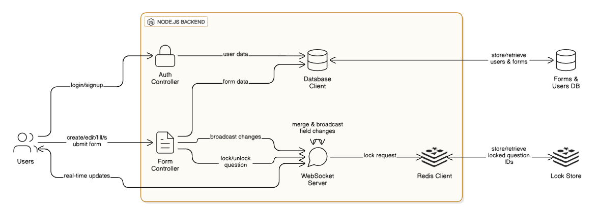

🚀 Setup & Run Instructions
 Run through Node.js
cd backend         # Enter the backend directory
npm install        # Install all required dependencies
node server        # Start the server
Your site will now be available at:
 --http://localhost:3000/

🐳 Run using Docker
docker build -t form .      # Build the Docker image
docker run -p 3000:3000 form  # Run the container on port 3000
You can now access your app at:
-- http://localhost:3000/

🌐 Access Online
The project is deployed at:
-- https://structured-form-1.onrender.com/

⚠️ Note:

Please disable AdBlock (it may block socket requests).

Use Chrome (Brave browser may flag socket requests as pop-ups).

Architecture Diagram

Technologies Used And Why
Frontend
⚛️ ReactJS: Enables faster deployment and development of dynamic, component-based user interfaces.
 -axios: Used to send HTTP requests from the frontend to the backend efficiently.
 -socket.io-client: Handles communication with the Socket.io server to support real-time updates and collaboration.
 -react-router: Manages client-side routing and enables rendering of different components based on the URL.

Backend
🟢 Node.js: Provides a runtime environment to execute JavaScript code server-side.
 -Express: A minimal and flexible framework to create an HTTP server and handle routing and middleware.
-Mongoose: Simplifies interactions with MongoDB and allows defining schemas for structured data.
 -redis client: Connects with Redis, and enables field locking to avoid race case conditions
⚡ socket.io: Facilitates real-time, bidirectional communication between clients and the server for live form updates.
 cors: Configured to securely allow cross-origin requests from the frontend.

Docker
🐳 Docker: Containerizes the application to ensure consistent environments across development, testing, and production. Simplifies deployment and scaling by packaging the app with its dependencies.

Key Features
Users can sign up and log in securely.

Users can create dynamic forms with customizable fields such as number, text, email, and dropdown.

Forms can be shared via a unique code to allow access by others.

Forms can be accessed and filled by users using the shared code.

Multiple users can collaborate on the same form simultaneously and provide answers concurrently.

Real-time synchronization of form responses is enabled using WebSockets, ensuring all collaborators see updates instantly.

Users can lock individual fields to answer them exclusively without interference from others.

Once completed, users can submit the form, and responses are securely stored and viewable by the form owner.

Edge Cases Handled
Concurrent Edits
To enable multiple users to collaborate on the same form simultaneously, the system uses WebSockets combined with Redis to track open and locked fields. Real-time updates are communicated via WebSocket events, allowing clients to respond to changes dynamically and avoid conflicting edits.

Race Condition & Field Locking
To prevent multiple users from editing the same field simultaneously and causing race conditions, the system implements a field-locking mechanism with a Time-To-Live (TTL) of 5 minutes:

When a user attempts to edit a field, the client sends a lockField event through the WebSocket, including the questionId.

The server stores this lock in Redis with the questionId as the key and the locking user's userId as the value, along with the TTL.

On subsequent edit attempts:

The system checks if the field is locked in Redis.

If not locked, editing is allowed.

If locked, it checks if the requester is the same user who holds the lock.

If yes, editing is permitted.

If no, editing is denied until the lock expires or is released.

This approach ensures safe, conflict-free collaborative editing with automatic lock expiry to avoid stale locks.

  